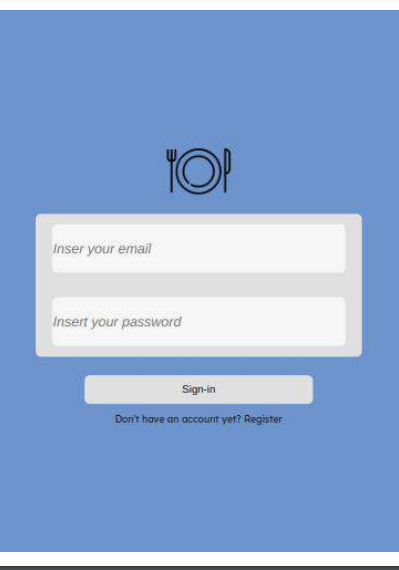
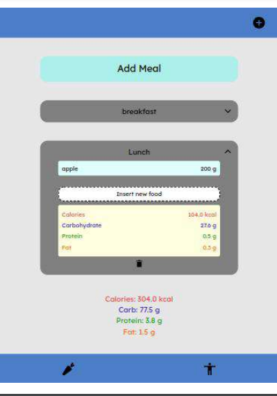
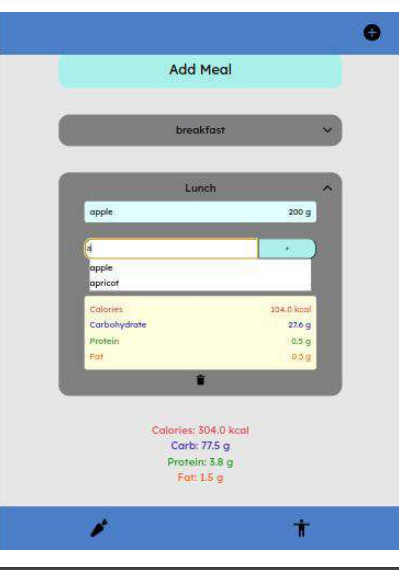
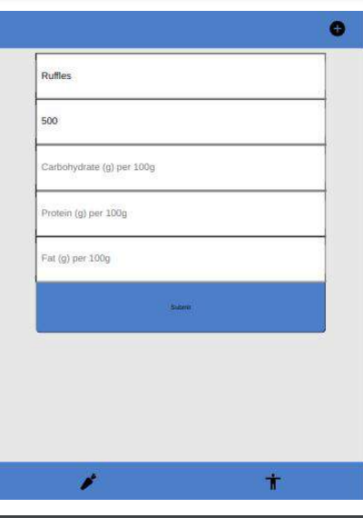
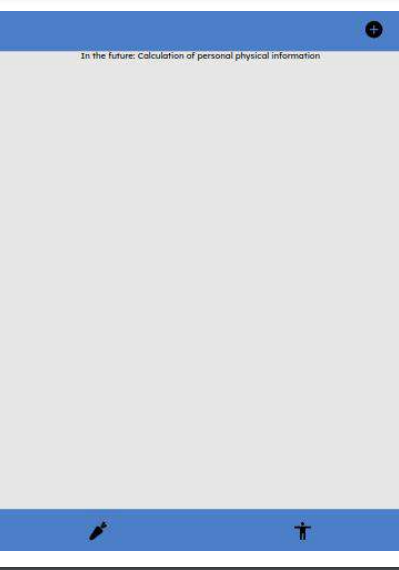

# Diet Manager

This is a personal project, made using React, Node.js and PostgreSQL, it is an MPV (Minimum Viable Project) for a food and fitness application.

On the home screen there is a tab for logging in or redirecting to user registration, where you are asked for your email and password (which is saved encrypted).The application uses login persistence through localstorage.
 
On the home screen we can see the diet registration tab, where the user can add. Create a new meal, open each meal to observe its contents, and analyze the macro and calorie information for all meals. Within each tab meal it is possible to observe information about the entire meal, delete the meal, access each food and insert new foods into the meal. By clicking on each food from the meal, we can remove it and observe its information, and to insert a food, with each letter typed, the app searches the local bank for foods that start with those initials and suggest to the user, when selecting the food they are asked for the quantity in grams of it.

When searching for the food, if it is not in the database, a request is made to an external API, with information about different foods (Edaman API), if found, it is added to the database for future requests. In addition to this diet tab, it is possible to enter a food into the bank manually, with your information, by clicking in the top right corner of the screen. In the lower corner of the screen we can access the personal physical information panel, a future implementation of the project.

 ## Technologies Used
 
* Typrescript, Node.js, Express.js, React.js
* PostgreSQL
* Nginx, Docker
* eslint, prisma
* jwt, bcrypt, joi, dotenv, axios

## Layout

## Running the project (with Docker)
 
Clone this repository, and within this clone the front-end and back-end repositories. Run docker-compose with "docker-compose up --build nginx", remember to add .env.development to the root of the backend
 
## Running the project (with Node.js)

Clone the front-end and back-end repositories, add .env to the front and .env.development to the back-end from the .env.example examples. Run "npm i" on both the front and back. Run the front-end with "npm run start", and the back-end with "npm run init"
 
 ## Repositories Link
 Front-end: https://github.com/Caio-Coldebella/gerenciador_dieta_frontend  
 Back-end: https://github.com/Caio-Coldebella/gerenciador_dieta_backend
